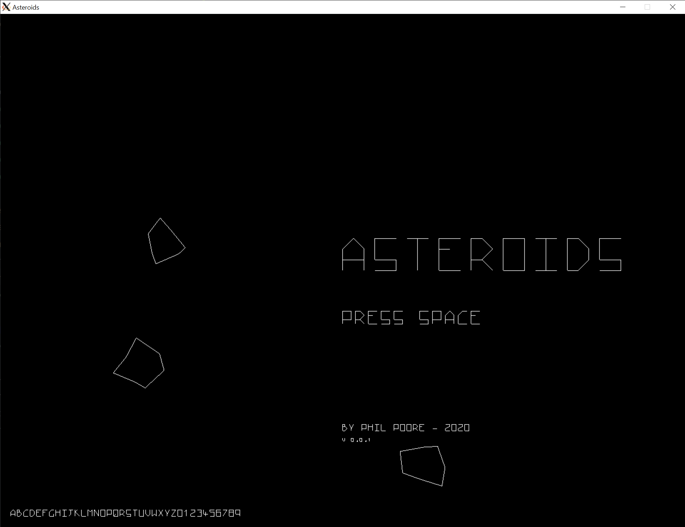
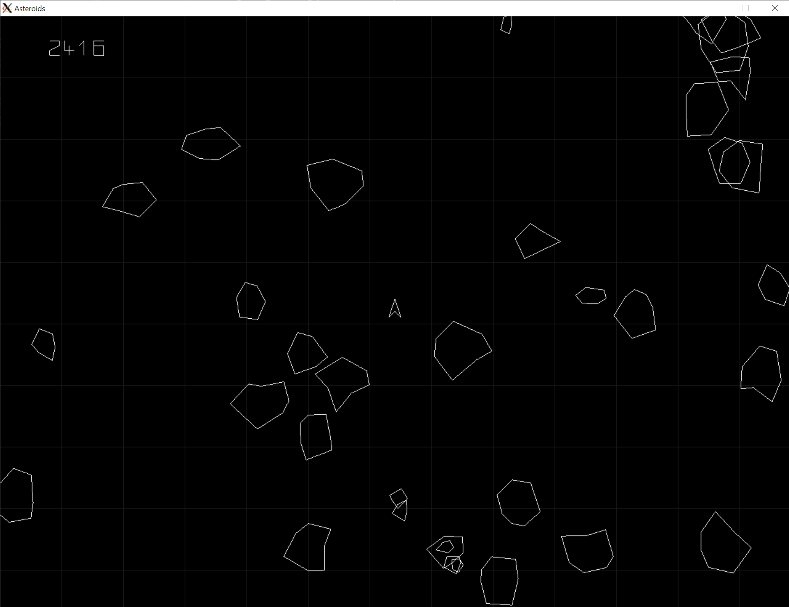

# Asteroids

Example implimentation of the classic retro game [Asteroids](https://en.wikipedia.org/wiki/Asteroids_(video_game))

Written in cpp using [OpenGL](https://www.opengl.org/) and [GLFW](https://www.glfw.org/).

Intended to be a easy intro into cpp game development.

## Features

- Vector style graphics
- Accurate collision detection
- Custom vector font
- Title screen
- Asteroids
- Simple score





# Build

*** Tested on linux. ***
```
# Install deps: glfw3 + opengl
sudo apt install libglfw3 libglfw3-dev libopengl-dev

make
```

# Contributing
Feature requests, Bug reports and PR welcome.

# TODO

- Game over
- Lives
- Better key press handling
- Particle effects
- Sound effects
- Flying Saucers
- Levels
- High scores
- Pause
- FPS counter

